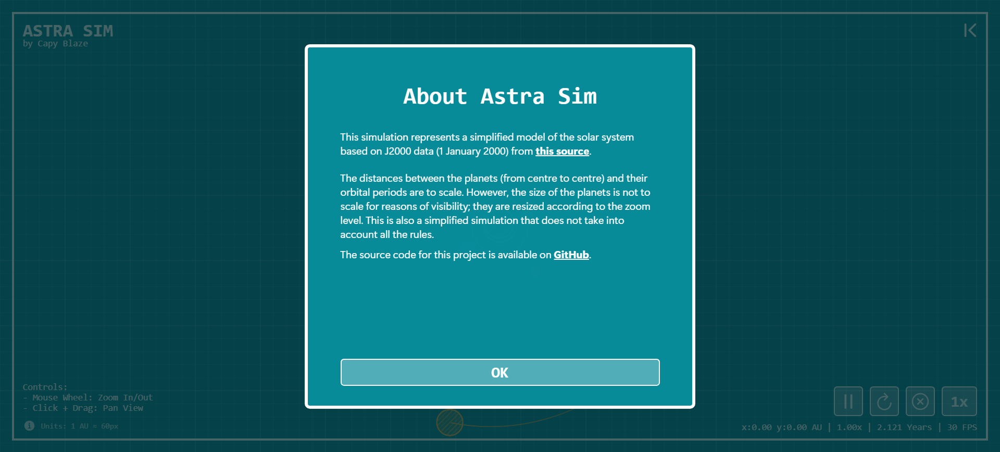
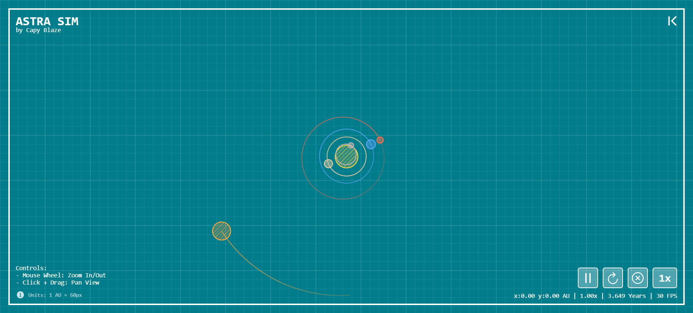
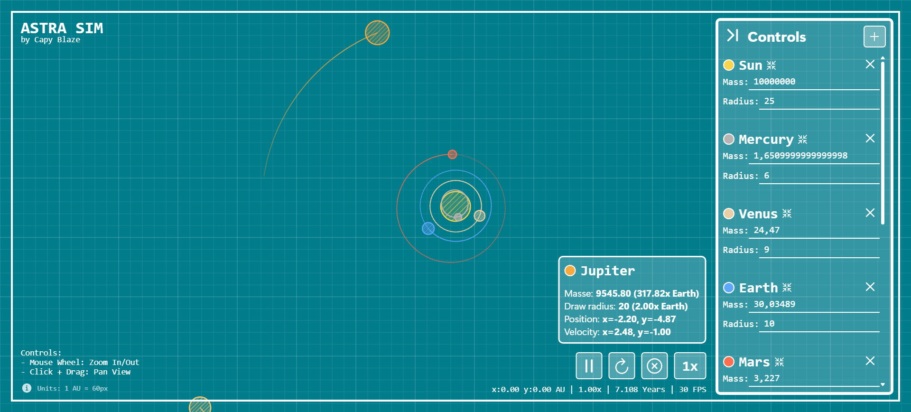
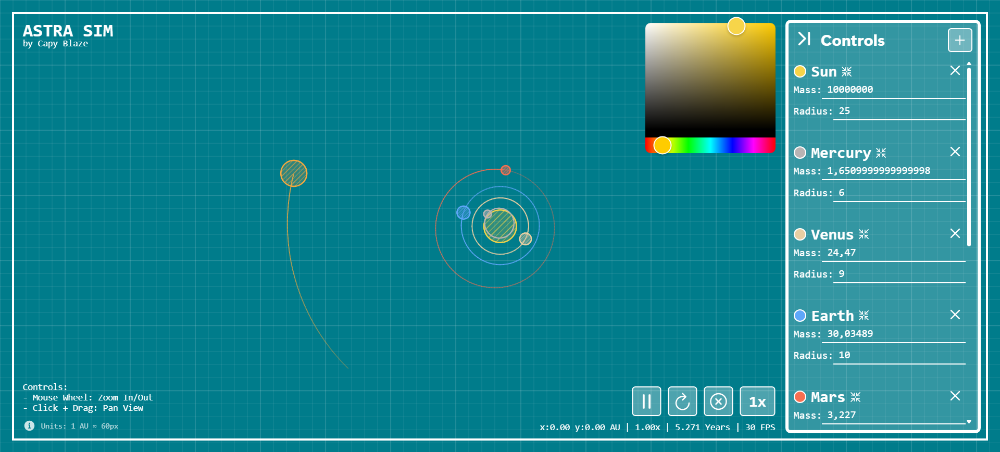

<a id="readme-top"></a>

<h1 align="center">Astra Sim</h1>

<p align="center">
  
  
  
  
</p>

AstraSim is an interactive gravitational N-body simulation built with React, TypeScript, and p5.js. Experience realistic orbital mechanics and create your own planetary systems!

<div align="center">
  <h3>
    <a href="https://xen0r-star.github.io/AstraSim/" target="_blank">
      👉 Live Demo 👈
    </a>
  </h3>
</div>

<br />

<details>
  <summary>🗂️ Table of Contents</summary>
  <ol>
    <li>
      <a href="#✨-features">✨ Features</a>
    </li>
    <li>
      <a href="#🚀-getting-started">🚀 Getting Started</a>
    </li>
    <li>
      <a href="#🎮-controls">🎮 Controls</a>
    </li>
    <li>
      <a href="#🛠️-tech-stack">🛠️ Tech Stack</a>
    </li>
    <li>
      <a href="#🏗️-project-structure">🏗️ Project Structure</a>
    </li>
    <li>
      <a href="#🤝-contributing">🤝 Contributing</a>
    </li>
    <li>
      <a href="#📝-license">📝 License</a>
    </li>
    <li>
      <a href="#👤-author">👤 Author</a>
    </li>
  </ol>
</details>

---


## ✨ Features

- **Real-Time N-Body Simulation**: Accurate gravitational physics using Newton's law of universal gravitation
- **Interactive Controls**: 
  - Click and drag to pan the view
  - Mouse wheel to zoom in/out
  - Click on planets to view detailed information
  - Add custom planets with configurable properties
- **Visual Trails**: See the orbital paths of planets with dynamic trail rendering
- **Time Control**: Adjust simulation speed from 0.25x to 20x
- **Customization**: Create planets with custom mass, velocity, radius, and color
- **Responsive UI**: Built with Framer Motion for smooth animations

<p align="right">(<a href="#readme-top">back to top</a>)</p>

# 📸 Screenshots
<table>
  <tr>
    <td>
      
    </td>
    <td>
      
    </td>
  </tr>
  <tr>
    <td>
      
    </td>
    <td>
      
    </td>
  </tr>
</table>

## 🚀 Getting Started

### Prerequisites

- Node.js (v18 or higher)
- npm or yarn

### Installation

1. Clone the repository:
```bash
git clone https://github.com/Xen0r-Star/AstraSim.git
cd AstraSim
```

2. Install dependencies:
```bash
npm install
```

3. Start the development server:
```bash
npm run dev
```

4. Open your browser and navigate to `http://localhost:5173`

<p align="right">(<a href="#readme-top">back to top</a>)</p>

## 🎮 Controls

- **Mouse Wheel**: Zoom in/out
- **Click + Drag**: Pan the view
- **Click on Planet**: Display planet information
- **Click Elsewhere**: Hide planet information
- **ESC**: Cancel planet placement mode

### Buttons

- ▶️/⏸️ **Play/Pause**: Start or stop the simulation
- 🔄 **Reset**: Restore initial configuration
- ❎ **Clear Trails**: Remove all orbital trails
- 1️⃣ **Speed**: Cycle through simulation speeds (0.25x - 20x)
- ◀️/▶️ **Unfold/Fold panel**: Toggle the control panel visibility
- ➕ **Add Planet**: Enter planet placement mode, then click to place a new planet with default properties (customizable afterward)
- ❌ **Delete Planet**: Remove the planet from the simulation
- 🎯 **Focus Planet**: Center the view on the selected planet
- 🔘 **Change Color**: Cycle through predefined planet colors

<p align="right">(<a href="#readme-top">back to top</a>)</p>

## 🛠️ Tech Stack

- **React 19** - UI framework
- **TypeScript** - Type safety
- **p5.js** - Graphics rendering
- **Framer Motion** - Animations
- **Vite** - Build tool

<p align="right">(<a href="#readme-top">back to top</a>)</p>

## 🏗️ Project Structure

```
src/
├── components/      # React components
├── config/          # Constants and planet data
├── draw/            # p5.js drawing functions
├── error/           # Error handling
├── physics/         # Simulation engine
├── provider/        # Providers components
├── types/           # TypeScript definitions
└── utils/           # Helper functions
App.tsx              # Main application component
Main.tsx             # Application entry point
style.css            # Global styles
```

<p align="right">(<a href="#readme-top">back to top</a>)</p>

## 🤝 Contributing

Contributions are welcome! Feel free to open issues or submit pull requests.

1. Fork the repository
2. Create your feature branch (`git checkout -b feature/AmazingFeature`)
3. Commit your changes (`git commit -m 'Add some AmazingFeature'`)
4. Push to the branch (`git push origin feature/AmazingFeature`)
5. Open a Pull Request

<p align="right">(<a href="#readme-top">back to top</a>)</p>

## 📝 License

This project is licensed under the MIT License - see the [LICENSE](LICENSE) file for details.

<p align="right">(<a href="#readme-top">back to top</a>)</p>

## 👤 Author

**Xen0r Star**
- GitHub: [@Xen0r-Star](https://github.com/Xen0r-Star)

<p align="right">(<a href="#readme-top">back to top</a>)</p>

---

Made with ❤️ by [Xen0r Star](https://github.com/Xen0r-Star)